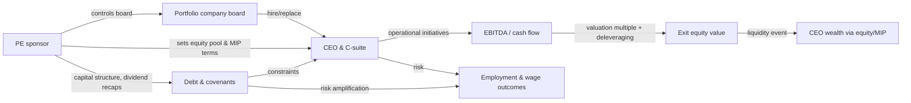
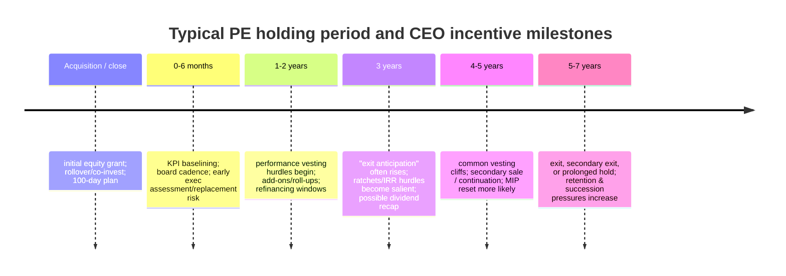

# Thought Processes of Private Equity Portfolio Company Executives

## Executive summary

Private equity (PE) portfolio company CEOs operate inside an incentive environment that is unusually *concentrated, illiquid, and exit-driven* compared with public-company executive labor markets. Across modern buyouts, research synthesis and large-sample evidence indicate that the CEO’s “big money” is typically **equity upside (often on the order of ~2%–10% of deal equity upside for the CEO)** plus meaningful downside exposure through required investment/rollover, rather than salary alone. citeturn10view0turn36view0turn12view0  

In practice, PE sponsors commonly set aside an **equity pool around ~10% of total shares** for executives and key employees, often delivered as appreciation-heavy instruments (e.g., stock options or profits interests) with **additional performance hurdles**. In one survey, the median equity pool was 10% of total shares (undiluted), with only ~63% of the pool granted close to the transaction date—leaving capacity for later hiring, replacement, and “reset” incentives. entity["company","Willis Towers Watson","consulting firm"] reports that stock options remained the most common vehicle (61% of respondents), shareholders/owners frequently add performance conditions to vesting, and rollovers (mandatory or voluntary) are materially less than universal. citeturn7view1  

The behavioral “center of gravity” for many portfolio CEOs is therefore *enterprise value creation sufficient to clear the sponsor’s hurdle and crystallize equity*. In entity["organization","KPMG","professional services firm"]’s survey-based work, management respondents reported that equity motivated them most; the same work documents deal-life-cycle effects (motivation spikes immediately post-deal and again around ~three years as an anticipated exit approaches), and highlights frictions when investors exit earlier than expected (because that can compress the time needed for management’s equity to become meaningfully valuable). citeturn39view0turn12view0turn11view2  

Governance and executive labor dynamics amplify these incentives. In a large-sample study of U.S. buyouts (enterprise value > $1B, 2010–2016), **71%** of target companies changed CEOs before exit; **~76.5%** of “first new CEOs” were external hires and **~66.9%** were complete outsiders. Where age could be obtained, the **mean and median** age of new CEO hires was **~51 years**. entity["organization","National Bureau of Economic Research","research organization"] sources also highlight that, in this segment, firm-specific human capital appears less central than in public-company CEO selection. citeturn30view0turn39view2  

Demographically, available survey evidence shows an overwhelmingly male CEO population in PE-backed settings: entity["organization","Heidrick & Struggles","executive search firm"] reports **95% men** (with very small female representation) in its 2024 PE-backed CEO compensation survey sample, and a separate European CEO-transition study found **~5%** of appointed CEOs were women. citeturn8view0turn31view0  

Finally, incentive design interacts with leverage and financial engineering in ways that can reshape executive decision-making under stress. Causal evidence on dividend recapitalizations suggests that a typical recap **raises total debt by ~84%**, increases bankruptcy likelihood substantially (estimated +31 percentage points over six years in one design), and is associated with sharply negative wage growth among survivors—while also fattening the right tail (e.g., higher chances of IPOs and exceptional growth). These patterns are consistent with incentive conflicts where actions that boost **deal IRR via earlier cash flows** can coexist with increased firm-level distress risk. entity["organization","U.S. Census Bureau","government agency"] working paper evidence and an entity["organization","National Bureau of Economic Research","research organization"] summary both support this framing. citeturn13view1turn13view0  

## Incentive structures that shape portfolio company CEO decisions

PE portfolio CEO “thought processes” are best modeled as repeated trade-offs among **exit value**, **time-to-liquidity**, **downside survival**, and **relationship constraints** (board/sponsor monitoring, lender covenants, and talent-market outside options). This section decomposes the core contract components that instantiate those trade-offs.

### Cash compensation as risk premium and liquidity bridge

Cash pay matters, but often as *stability* and *risk compensation*, not the main wealth engine. In the 2024 PE-backed CEO compensation survey, average U.S. base compensation was reported at **$524k** and the average cash bonus received (for the prior year) at **$386k**, implying average cash compensation around **$910k** (U.S. sample). The same survey reports that most CEOs also receive equity compensation (both ongoing and at hire). citeturn7view2  

A parallel theme from research on CEO contract redesign under strong private principals is that base and bonus can *increase* rather than decrease post-buyout, plausibly as compensation for higher job risk and more performance-sensitive contracts. In a study summarized by the authors, base salary and bonuses increased by **~25%**, with bonus targets and performance metrics being redesigned toward more measurable, cash-flow-relevant criteria. citeturn18view0  

**Decision implication:** cash serves as (i) a “cost of living” bridge through an illiquid holding period and (ii) partial insurance against the elevated probability of replacement. citeturn12view0turn30view0  

### Equity pools and management incentive plans as the primary wealth lever

A defining feature of PE-owned portfolio incentives is the scale and structure of the management equity upside.

*Surveyed plan design (contemporary):* A survey summarized by WTW found a median equity pool reserved for executives and key employees of **10% of total shares outstanding (undiluted)**. Of that pool, **~63%** was typically allocated at or near the time of investment (with the remainder held for later grants), and the major award type was stock options (61% of respondents), followed by profits interests (44%); full-value awards (e.g., RSUs) were far less common (11%). citeturn7view1  

*Sponsor-return alignment features:* KPMG’s survey-based analysis similarly reports that investors typically set aside **at least 10%** of share capital for “sweet equity,” with a third allocating more than 15%. It also notes that “ratchets” (increasing management’s share of the upside when investor-return thresholds are exceeded) were confirmed by about two-thirds of investors. citeturn7view0turn12view0turn11view0  

*Academic synthesis (typical magnitudes):* A research review reports that, in a set of U.S. leveraged buyouts (1996–2004), the **median CEO received ~5.4% of the equity upside**, while the management team collectively received **~16%**. citeturn36view0  

**Decision implication:** these equity structures concentrate attention on levers that improve exit equity value—often operationally mediated through EBITDA, cash generation, and/or strategic repositioning—because that is how management’s equity becomes valuable. citeturn11view0turn18view0turn7view1  

### Co-investment and equity rollover as forced “skin in the game”

PE deals frequently require management to be meaningful investors, not just recipients of options. In KPMG’s survey, management on a typical primary deal could be required to invest **up to 50% of base pay** into the equity (“investor strip”), and on a secondary deal could be required to reinvest **~30%–49%** of net proceeds. citeturn12view0turn11view4  

WTW reports a different but compatible framing: only about **one-third** of respondents reported a rollover requirement and **39%** reported a voluntary rollover program, implying substantial heterogeneity by sponsor and deal context (including management bargaining power). citeturn7view1  

**Decision implication:** required investment alters risk preferences and attentional focus. KPMG’s respondents explicitly describe the need for investment levels that “matter” but are not so large that managers “can’t sleep at night,” highlighting a deliberate attempt to calibrate risk-taking rather than maximize it. citeturn12view0turn39view0  

### Vesting schedules, performance conditions, and “leaver” economics

A major difference between PE-backed and many public-company plans is that time-based vesting is often *not* sufficient; performance and continued employment are heavily emphasized.

KPMG reports that if management leaves before a certain date, they normally **forfeit** sweet equity; “good” and “bad” leaver provisions are typical. It also reports that a typical vesting period is **four or five years, or otherwise on exit**. citeturn11view0turn11view2  

WTW reports that **78%** of respondents required satisfaction of performance conditions for all or some equity awards to vest, rather than vesting simply based on continuous employment. citeturn7view1  

In the CEO contract redesign study summarized by the authors, unvested options and restricted stock were forfeited to a larger extent if a CEO was dismissed; sponsors also restricted resale of vested shares for dismissed executives via rights of first refusal and limitations on permitted transferees. citeturn18view0  

**Decision implication:** these provisions create a strong “stay + perform” logic, but also heighten *career risk*. That elevated career risk is a key driver of sponsor demands for transparency, cadence, and measurable KPI progress. citeturn31view0turn30view0turn18view0  

### Leverage incentives, lender constraints, and metric choice

Leverage is not only a capital-structure choice; it changes the *cognitive landscape* for the CEO by making liquidity, covenant compliance, and refinancing windows salient.

A Federal Reserve working paper frames the debate: detractors argue PE managers over-lever due to option-like payoffs; the paper proposes that PE ownership can lead to higher optimal leverage by reducing expected distress costs (e.g., via lower asset volatility), though this remains an empirical controversy. citeturn33view0turn40view2  

Empirically, sponsor-driven metric selection attempts to reduce managerial discretion where accounting can be gamed. The CEO contract redesign evidence reports a shift away from qualitative and earnings-based measures to **cash-flow-based measures** such as EBITDA, and long-term performance criteria based on **IRR or multiples**. citeturn18view0  

**Decision implication:** portfolio CEOs tend to reason in constraint sets—what actions improve EBITDA/cash flow while staying inside covenant and refinancing tolerances—because equity value is path-dependent on survival. citeturn18view0turn13view1turn33view0  

### Tax considerations that influence instrument choice

Tax is often not a “side issue” for portfolio executives because the difference between **income** and **capital** treatment can dominate net outcomes at exit, especially when equity is the primary wealth lever.

KPMG reports that with large differences between capital and income tax rates, tax can occupy a prominent position in structuring management’s investment; over **65%** of management respondents said tax was “very important.” citeturn11view3  

In the U.S., many equity instruments for private companies implicate Internal Revenue Code §83 (property transferred in connection with services). The entity["organization","Internal Revenue Service","us tax agency"] provides an **83(b) election** mechanism (Form 15620) that allows recognition of income at transfer for substantially nonvested property, rather than at vesting. citeturn23search2turn23search6  

For partnership/LLC structures, IRS safe harbors for “profits interests” (subject to conditions and exceptions) are articulated in Rev. Proc. 93-27 and Rev. Proc. 2001-43, which state that receipt of a qualifying profits interest for services generally is not treated as a taxable event for the partner or partnership. citeturn23search1turn23search0  

**Decision implication:** instrument selection (options vs profits interests vs direct share purchase/rollover) is often negotiated alongside vesting, performance hurdles, and leaver rules because after-tax outcomes influence both retention and perceived fairness. citeturn11view3turn7view1turn12view0  

## Behavioral effects of these incentives

This section links contract structure to “thought patterns”—the mental models and default priorities that portfolio CEOs adopt under PE ownership.

### Equity salience, illiquidity, and the “exit clock”

KPMG’s survey indicates equity is viewed as the optimum way to realize personal wealth and is the dominant motivator for management; the same analysis suggests motivation intensifies immediately post-deal (ownership salience) and again around the multi-year mark as exit anticipation rises. citeturn39view0turn12view0  

A research synthesis argues that when management equity is illiquid (cannot be monetized until a credible exit), it can reduce incentives to manipulate short-term performance because the CEO cannot readily cash out on transient metrics. citeturn36view0  

**Resulting thought process:** “What gets us to an exit-quality story and price?” dominates “What beats next quarter?”—but only when the deal’s timeline and governance are stable. When exits happen earlier than expected, KPMG reports management may view their sweet equity as losing value (insufficient time for appreciation), which can damage relationships and trigger renegotiations/resets. citeturn11view2turn12view0  

### KPI compression toward EBITDA/cash flow and measurable milestones

Under strong-principal governance, contracts and oversight tend to compress toward measurable signals such as EBITDA and return multiples. The CEO contract redesign study reports a move away from qualitative and earnings-based measures toward EBITDA/cash-flow measures and longer-term IRR/multiple criteria. citeturn18view0  

WTW similarly observes that PE-backed portfolio companies typically do not grant equity annually; rather, initial grants are designed to retain and motivate through the sponsor’s life with the asset, and performance conditions are common. citeturn7view1  

**Resulting thought process:** executives learn to translate strategy into measurement: “Which operational initiatives move the few KPIs the board and lenders will price?”—and to prioritize initiatives with fast, auditable effects (pricing discipline, procurement, working capital, sales productivity) when leverage is high. This is reinforced by the high rate of CEO turnover under PE ownership. citeturn31view0turn30view0turn18view0  

### Metric gaming risk: IRR optics and dividend recapitalizations

Some incentives and industry norms make IRR-particular behaviors attractive even when they raise tail risk.

Causal evidence on dividend recapitalizations finds a typical recap increases total debt by **~84%**, increases bankruptcy likelihood substantially over a multi-year horizon, and is associated with strong negative wage growth among surviving firms; at the same time, it increases the probability of exceptional right-tail outcomes (including IPOs and high revenue growth among survivors). The same work reports that dividend recaps can increase deal IRR largely by bringing cash flows forward in time, even when cash-on-cash multiples are not significantly improved. citeturn13view1turn40view1  

An NBER summary of related work reports that dividend recapitalizations increase the chance of financial distress and can raise deal returns while potentially reducing fund returns, consistent with moral hazard. citeturn13view0  

**Resulting thought process:** under certain sponsor constraints, executives may face “optics vs resilience” tensions—e.g., actions that accelerate distributions or near-term EBITDA at the cost of higher leverage and reduced investment flexibility. Even when CEOs are not the direct beneficiaries of IRR optics, they manage inside consequences created by those actions (refinancing pressure, cost controls, and labor outcomes). citeturn13view1turn12view0turn33view0  

### Growth versus extraction in leadership selection signals

A complementary, qualitative pattern is that sponsors increasingly value leadership competencies associated with growth execution, not only cost takeout.

A Russell Reynolds analysis of 75 buyouts (2008–2015) reports that sales and operational leadership experience were more linked to success than finance, and that “rationalizing costs is no longer a differentiator.” It also reports that investment professionals viewed results orientation and urgency as the most important competencies for portfolio leadership, more so than strategic vision. entity["organization","Russell Reynolds Associates","executive search firm"] citeturn29view0  

In a European CEO-transition study, PE firms are described as more hands-on post-crisis, building operating-partner and functional expert teams, and placing greater emphasis on rigorous assessment in the first 100 days. entity["organization","Spencer Stuart","executive search firm"] citeturn31view0turn32view0  

**Resulting thought process:** executives interpret sponsor behavior as a signaling system—what the board asks for weekly is what matters. When the sponsor’s “ask” shifts from pure efficiency to integration and growth (e.g., roll-ups, add-ons, go-to-market), CEOs adapt by building teams and systems capable of scaling—not only by cutting. citeturn32view0turn31view0turn29view0  

## Anthropological and demographic patterns among PE portfolio CEOs

This section synthesizes what is known (with data) about who these executives are, how they are selected, and what cultural norms tend to hold, with explicit notes where data are thin.

### Demographics and representation

In the 2024 PE-backed CEO compensation survey, respondents were overwhelmingly men: **95% men**, **1% women**, and **4% prefer not to answer** (n=511). Where ethnicity data were available in that survey, the majority of respondents were white (U.S.: 86%; U.K.: 98%). citeturn8view0turn7view2  

In a European CEO-transition dataset (236 transitions, 2009–2018), only **~5%** of appointed CEOs were women, with no improvement in gender diversity reported over time in that sample. citeturn31view0  

**Implication:** the available evidence consistently indicates low gender diversity among PE portfolio CEOs; this can narrow the “role model” set that sponsors and boards implicitly use and may perpetuate path dependence unless search and succession processes change. citeturn31view0turn32view0  

### Career paths and the structure of the CEO labor market

A large-sample study of large U.S. buyouts (2010–2016) reports that CEO replacement is the norm rather than an exception (71% of companies changed CEO before exit). Among first new CEOs, **~76.5%** were external hires and **~66.9%** were complete outsiders; mean/median age for new hires (where available) was **~51**. citeturn30view0turn39view2  

A European CEO-transition study finds an even stronger tilt toward outsiders: only **19%** of appointed CEOs were insiders; it notes a preference for proven CEOs and a willingness to hire “best-athlete” CEOs, including non-nationals and executives from outside the sector. citeturn31view0  

By contrast, Russell Reynolds’ analysis reports that within the *top-performing* subset of buyouts (top 25), excluding founders, **63%** of CEOs were internal appointments—an important reminder that “outsider dominance” is a *central tendency*, not a universal rule, and that top performance can correlate with internal leadership under certain conditions (e.g., strong incumbent operators aligned with the thesis). citeturn29view0turn30view0  

**Implication:** portfolio CEO careers often resemble a “project market”: executives move across companies and ownership situations, with selection focused on transferable industry capabilities and willingness to operate under intense owner oversight. citeturn30view0turn31view0  

### Social networks and elite reproduction mechanisms

Network-based selection and deal origination contribute to elite reproduction. In a study of PE take-private targeting (2000–2007), having a director with prior LBO experience through board service made a company **~40% more likely** to receive a PE offer; the effect varied by director influence and quality of prior LBO experience. citeturn37view0  

This matters for portfolio executives because board networks influence who becomes a target, who becomes CEO, and which operators circulate across PE-backed assets via board seats, operating-partner roles, and repeat CEO appointments. Spencer Stuart’s European dataset notes that among “best-athlete” CEOs hired without direct sector experience, **two-thirds** had previously worked in a PE-backed business or as an operating partner—strong evidence of a recurring “PE-experienced operator” class. citeturn31view0  

**Implication:** PE portfolio CEO ecosystems can become closed “reputation networks,” where prior PE-backed experience, board ties, and sponsor relationships act as credentials—accelerating hiring and alignment, but risking homogeneity in leadership approaches. citeturn31view0turn37view0  

### Cultural norms and decision-making style under PE oversight

Two recurrent cultural demands on portfolio CEOs are **collaboration with owners** and **decision speed under scrutiny**.

Spencer Stuart explicitly frames a “unique challenge” for PE investors: assessing whether a CEO can work openly and collaboratively with new owners, adapt to the owner’s approach, and use the support provided—warning that CEOs who maintain distance from owners can underperform regardless of capability. citeturn31view0turn32view0  

Russell Reynolds’ assessment-based findings describe successful portfolio CEOs as more “humble,” with an even manner and greater empowerment of teams; CEOs who exited midway were described as more independent and less rule/process oriented—traits that can conflict with sponsor-driven alignment requirements. citeturn29view0  

**Implication:** the “thought process” norm is not simply analytical optimization; it includes a *relational optimization*—managing alignment with sponsor expectations, information cadence, and governance rituals while executing transformation. citeturn31view0turn29view0turn18view0  

### Governance roles and board entanglement

Portfolio CEOs are often entangled with the board more directly than in many public-company settings. In the 2024 PE-backed CEO compensation survey, **88%** of CEOs reported sitting on their company’s board; **20%** served as chair. The same survey reports common rationales for a CEO change: **38%** said inadequate value creation under prior leadership, and **32%** founder succession. citeturn8view0turn7view2  

Meanwhile, Heidrick’s 2026 analysis reports that over **70%** of CEOs at PE-backed companies are replaced during the average holding period, and emphasizes that incentive misalignment can “freeze” leadership teams if incentives are too tightly tied to the original thesis. citeturn32view0  

**Implication:** CEOs reason under continuous evaluative pressure, where evolution of the investment thesis and holding period changes can require incentive redesign (“MIP resets”) and leadership realignment. citeturn32view0turn11view2  

## Dossier section with tables and illustrative charts

This dossier formalizes the incentive and demographic patterns into reusable analytical artifacts. “Typical” means *empirically grounded central tendencies*; realized outcomes remain highly dispersed and sensitive to deal structure, sector cyclicality, and sponsor style. citeturn7view1turn30view0turn13view1  

### Ownership and governance relationships

The following stylized map integrates fund/sponsor pressures (return and time), capital structure constraints (debt), and executive rewards (equity + vesting/leaver rules) into a single causal logic chain. citeturn18view0turn7view1turn12view0turn13view1  

### Deal lifecycle timeline and incentive “trigger points”

Holding periods are often measured in years (not quarters), and vesting frequently aligns with the expected hold/exit window, with resets common when the lifecycle lengthens or performance diverges from the entry case. citeturn32view0turn36view0turn11view2turn12view0  

### Chart comparing incentive weightings across PE deal types

The chart below is **illustrative** (a stylized “expected value share” representation), calibrated to empirical design facts: (i) equity is consistently reported as the strongest motivator, (ii) equity pools around ~10% are common, (iii) performance conditions and leaver forfeiture are prevalent, and (iv) cash pay functions as a bridge and risk premium. citeturn39view0turn7view1turn11view0turn18view0turn30view0  

```mermaid
xychart-beta
  title "Stylized CEO pay-mix emphasis in PE portfolio companies (expected value share)"
  x-axis ["Buyout","Growth","Distressed/Turnaround"]
  y-axis "Share of expected compensation (%)" 0 --> 70
  bar "Base salary" [15,20,25]
  bar "Annual cash bonus" [20,15,25]
  bar "Equity/MIP upside" [55,55,40]
  bar "Co-invest / rollover (at-risk capital)" [10,10,10]
```

### Incentive component map and behavioral hypotheses

| Incentive component | Typical design signals in PE portfolio context | Behavioral hypothesis (“thought process” effect) | Primary support |
|---|---|---|---|
| Base salary | Often meaningful but not dominant wealth; can rise post-buyout as risk premium | Liquidity bridge; partially insulates from illiquidity and replacement risk | citeturn7view2turn18view0turn30view0 |
| Annual cash bonus | Common; performance-linked; may be less important than equity | Focus on near-term operational milestones, but mainly as stepping stones to equity value | citeturn12view0turn18view0turn7view2 |
| Equity/MIP (“sweet equity”) | Pool ~10% common; appreciation-heavy awards; ratchets, IRR/multiple hurdles | Owner-like framing; prioritizes exit value creation and de-levering / multiple expansion | citeturn7view1turn11view0turn36view0 |
| Co-invest / rollover | Often required (but not universal); can be large share of base pay or net proceeds | Increases downside salience; can reduce reckless risk-taking while raising “survival focus” | citeturn12view0turn7view1 |
| Leaver / forfeiture / repurchase | Good/bad leaver rules; forfeiture; resale restrictions post-dismissal | Elevates career risk; reinforces compliance with sponsor governance norms and cadence | citeturn11view0turn18view0turn28view0 |
| Leverage and recap decisions | Debt amplifies both value creation and distress tails; dividend recaps can pull returns forward | Can create temptation for IRR-enhancing actions (cash-forwarding), increasing tail risk | citeturn13view1turn33view0turn13view0 |

### Comparative incentive profiles across PE firm types

This table focuses on how a *portfolio CEO* incentive package is typically shaped (not how the GP is compensated). “Typical” profiles are best read as archetypes. citeturn7view1turn11view0turn18view0turn13view1turn31view0  

| Deal type | Capital structure & constraint environment | Incentive emphasis | Common performance metrics in incentives | Governance pattern affecting CEO cognition |
|---|---|---|---|---|
| Buyout | Higher leverage, covenant/refi sensitivity; exit often central | Larger equity upside & strong leaver clauses; meaningful co-invest/rollover | EBITDA/cash flow, MOIC/IRR thresholds; ratchets common | High replacement probability; tight board cadence; speed & measurability rewarded citeturn30view0turn11view0turn18view0 |
| Growth | Often lower leverage than classic buyout; more reinvestment for scaling | Equity upside still central; options common; performance hurdles frequent | Revenue/ARR growth and cash efficiency often operationally tracked; equity awards still investment-return oriented | Talent-building and integration (platform expansion) emphasized; leadership capability viewed as key lever citeturn7view1turn32view0turn29view0 |
| Distressed / turnaround | Liquidity constraints; restructuring milestones; high job risk | Higher cash/retention component; equity upside may exist but is more uncertain; frequent resets | Liquidity, covenant compliance, restructuring milestones; exit value contingent | “Survival-first” governance; board may replace quickly if turnaround stalls; incentives often re-cut as facts change citeturn13view1turn11view2turn31view0 |

## Examples and case studies with sourced data

### Case study on equity “step-up” under PE ownership: entity["company","Petco","pet supplies retailer"] and entity["people","Bruce Devine","Petco CEO"]

A concrete documented example of how PE ownership changes CEO incentives comes from a study that tracks executive ownership changes around take-private events. The authors describe that during Petco’s public phase (1995–1999), Devine owned about **~2%** of equity; after Petco was taken private in 2000, his ownership share increased sharply to about **~10%**. When the company undertook an IPO in 2002, his share was reduced (about **~7%**) and continued to fall thereafter. citeturn6view1  

**Interpretation for CEO cognition:** the CEO’s internal valuation model changes: marginal initiatives are evaluated not only by annual bonus impact, but by expected influence on exit valuation and equity monetization—while also knowing that equity value becomes realizable only at exit (and can be diluted post-IPO). citeturn6view1turn36view0  

### Case study on vesting, performance units, and reserved equity capacity: entity["company","SolarWinds","IT management software company"]

A public filer that emerged from PE ownership illustrates common design features in disclosed equity plans. In its 2023 annual filing, SolarWinds reports that under its 2018 equity incentive plan it had **11,487,804** stock-based incentive awards outstanding and **39,231,258** shares reserved for future grants; it also states that RSUs generally vest over **four years** and PSUs generally vest over **three years** based on specified performance targets and continued service. The same filing describes repurchase rights for certain restricted stock upon employee termination and notes historical repurchases of unvested restricted stock on employee terminations. citeturn28view0  

**Interpretation for CEO cognition:** plan capacity (reserved shares) and performance-unit design support a “governance toolchain”: sponsors/boards can (i) incent retention and (ii) restructure, refresh, or add leaders during roll-ups and extended holds without re-writing the entire compensation system. citeturn28view0turn32view0  

### Case study on leverage-driven stress and stakeholder outcomes: dividend recapitalizations

Evidence on dividend recapitalizations provides a sharp illustration of how sponsor-level finance decisions can reshape the executive decision environment. In causal estimates, dividend recaps increase leverage dramatically (a typical recap increases total debt by ~84%) and are estimated to increase bankruptcy likelihood meaningfully over the subsequent years; among survivors, the same analysis finds large negative wage growth effects, while also finding increased probability of extreme right-tail outcomes such as IPOs. It also shows that dividend recaps increase deal IRR, plausibly due to earlier cash realizations rather than improved cash-on-cash multiples. citeturn13view1turn40view1  

**Interpretation for CEO cognition:** even when CEOs are operationally oriented, their “feasible set” tightens under recapitalized leverage: investment timing, headcount decisions, pricing, and working capital become entangled with refinancing constraints—raising the likelihood of cost-cutting and wage pressure in downside states. citeturn13view1turn40view2turn39view3  

### Case study on incentive renegotiation: MIP resets and early/late exits

KPMG reports that portfolio companies often revisit the terms of management’s investment partway through a deal when performance is not as anticipated or the expected lifecycle changes; it frames the “reset” as potentially critical to continued motivation. KPMG also quotes management respondents noting that an early investor cash-out can “kill” the value of management sweet equity, creating a demand for mechanisms to address lost opportunity value. citeturn11view2turn12view0  

Heidrick’s 2026 analysis similarly warns that incentives too tightly tied to the initial thesis can create a “frozen” leadership team unwilling to adapt as the thesis evolves during longer holds. citeturn32view0  

**Interpretation for CEO cognition:** executives in extended holds tend to re-anchor their thinking from “single exit sprint” to “multi-act ownership,” updating personal utility functions around (i) probability of replacement, (ii) whether equity remains “in the money,” and (iii) whether incentives will be reset to reflect a changed strategy. citeturn11view2turn32view0  

## Data gaps and what cannot be concluded rigorously

Compensation data for PE portfolio company executives is structurally incomplete because many portfolio companies are private and do not disclose executive pay. Even research that uses “reverse LBO” IPO disclosures notes that only a minority of PE-owned firms exit through IPO in many historical samples, producing selection concerns. citeturn35view0turn6view1  

Education and socioeconomic background statistics (e.g., share with MBAs, elite university concentration, family background) are not consistently available in the most credible large-N sources used here. The strongest demographic evidence in accessible public research is for **gender**, **ethnicity** (limited geographies), and **age**, along with experience/career-path proxies. citeturn8view0turn30view0turn31view0  

“Anthropological” claims about cultural norms and decision-making styles are better supported by executive search firm datasets and qualitative syntheses than by ethnographic fieldwork in the strict anthropological sense; the available materials emphasize collaboration norms, urgency, and leadership traits (e.g., humility vs independence) but are not deep participant-observation ethnographies. citeturn31view0turn29view0turn32view0  

Finally, causal attribution from outcomes (employment/wages/distress) to *CEO thought processes* must be treated cautiously: observed outcomes reflect joint optimization/constraints from sponsors, lenders, macro conditions, and sector dynamics. The best evidence supports that PE buyouts are associated with modest net employment impacts but higher job reallocation (“creative destruction”), and that leverage-increasing events like dividend recaps can materially increase distress risk and wage pressure in downside realizations. citeturn39view3turn13view1turn34view0
